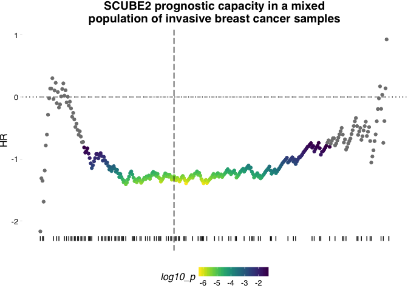
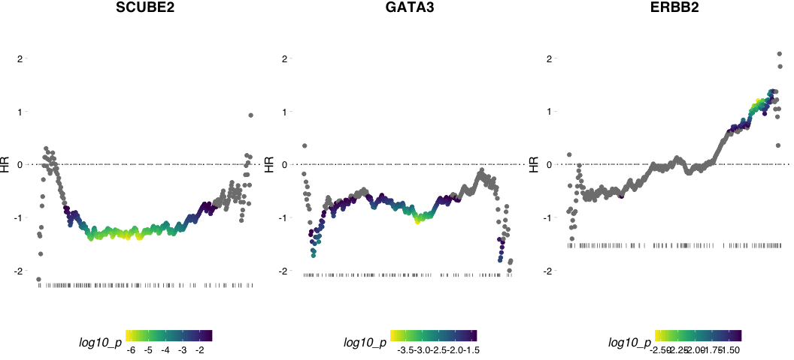
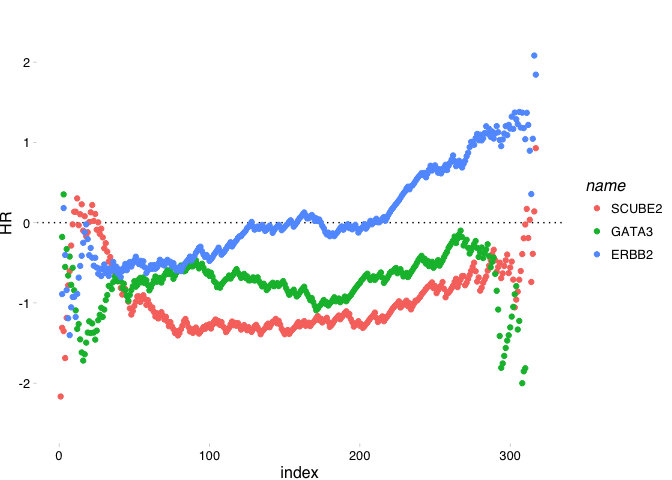

Basic Usage
================
Dominic Pearce, The Institute of Genetics and Molecular Medicine, The University of Edinburgh
2018-04-30


 

#### Quick example using NKI breast cancer data

*note: this data is pre-subsetted to only include patients with complete distant metastasis information (e.dmfs & t.dmfs)*

``` r
library(survivALL)
library(Biobase)
library(ggplot2)

data(nki_subset)
```

Example : Plotting
------------------

We use a continuous measure, here a vector of gene expression, to re-order our survival data and then compute hazard ratios and pvalues for all points of separation

``` r
xpr_vec <- exprs(nki_subset)["NM_020974", ] #expression vector for SCUBE2 (anti-correlated with proliferation)

plotALL(
        measure = xpr_vec, #expression data
        srv = pData(nki_subset), #survival information
        time = "t.dmfs", #time-to-outcome
        event = "e.dmfs", #outcome type
        bs_dfr = c(), #thresholding data would go here
        measure_name = "SCUBE2", #our gene's name
        title = "SCUBE2 prognostic capacity in a mixed\npopulation of invasive breast cancer samples", #plot title
        )
```


 

Note that we can add additional elements using standard `ggplot2` syntax. Here we add a horizontal indicator of the most significant point of separation

``` r
a_random_x_axis_value <- 123

plotALL(measure = xpr_vec, 
        srv = pData(nki_subset), 
        time = "t.dmfs", 
        event = "e.dmfs", 
        bs_dfr = c(),
        measure_name = "SCUBE2", 
        title = "SCUBE2 prognostic capacity in a mixed\npopulation of invasive breast cancer samples") + 
    geom_vline(xintercept = a_random_x_axis_value, linetype = 5)
```



### Plotting multiple genes simultaneously

We first organise our measure data, our expression vectors for three genes of interest **SCUBE2**, **FOS** and **ERBB2** before applying each in a loop, specifying a common and sensible y-axis range using `ggplot2` conventions. (To choose the limits we produce the plots first, select a rational range by eye and then recompute with the newly specified limits). We then combine the figures using the `cowplot::plot_grid()` function.

``` r
geneset <- data.frame(refseq_id = c("NM_020974", "NM_002051", "NM_004448"), hgnc_id = c("SCUBE2", "GATA3", "ERBB2"), stringsAsFactors = FALSE)

xpr_lst <- lapply(geneset$refseq_id, function(id){
                exprs(nki_subset)[id,]
        })
names(xpr_lst) <- geneset$hgnc_id

plot_lst <- lapply(geneset$hgnc_id, function(id){
                       plotALL(
                               measure = xpr_lst[[id]], #expression data
                               srv = pData(nki_subset), #survival information
                               time = "t.dmfs", #time-to-outcome
                               event = "e.dmfs", #outcome type
                               bs_dfr = c(), #thresholding data 
                               measure_name = id, #our gene's name
                               title = id #plot title
                               ) + 
                           ylim(-2.5, 2.5)  
        })
```

``` r
cowplot::plot_grid(plotlist = plot_lst, nrow = 1)
```



Example : Returning a dataframe
-------------------------------

Alternatively, we can return only the computed statistics as a dataframe for further calculations, comparisons and manipulations

``` r
survivall_out <- survivALL(
                           measure = xpr_vec, #expression data
                           srv = pData(nki_subset), #survival information
                           time = "t.dmfs", #time-to-outcome
                           event = "e.dmfs", #outcome type
                           bs_dfr = c(), #thresholding data
                           measure_name = "SCUBE2" #our gene's name
                           )
```

``` r
head(survivall_out)
```

<table style="width:100%;">
<caption>Table continues below</caption>
<colgroup>
<col width="18%" />
<col width="13%" />
<col width="17%" />
<col width="10%" />
<col width="13%" />
<col width="13%" />
<col width="13%" />
</colgroup>
<thead>
<tr class="header">
<th align="center"> </th>
<th align="center">samples</th>
<th align="center">event_time</th>
<th align="center">event</th>
<th align="center">measure</th>
<th align="center">HR</th>
<th align="center">p</th>
</tr>
</thead>
<tbody>
<tr class="odd">
<td align="center"><strong>NKI_369</strong></td>
<td align="center">NKI_369</td>
<td align="center">1190</td>
<td align="center">TRUE</td>
<td align="center">-1.316</td>
<td align="center">-2.166</td>
<td align="center">0.2303</td>
</tr>
<tr class="even">
<td align="center"><strong>NKI_226</strong></td>
<td align="center">NKI_226</td>
<td align="center">972</td>
<td align="center">FALSE</td>
<td align="center">-1.308</td>
<td align="center">-1.311</td>
<td align="center">0.4321</td>
</tr>
<tr class="odd">
<td align="center"><strong>NKI_175</strong></td>
<td align="center">NKI_175</td>
<td align="center">2774</td>
<td align="center">TRUE</td>
<td align="center">-1.301</td>
<td align="center">-1.351</td>
<td align="center">0.2548</td>
</tr>
<tr class="even">
<td align="center"><strong>NKI_57</strong></td>
<td align="center">NKI_57</td>
<td align="center">839</td>
<td align="center">TRUE</td>
<td align="center">-1.29</td>
<td align="center">-1.687</td>
<td align="center">0.09268</td>
</tr>
<tr class="odd">
<td align="center"><strong>NKI_332</strong></td>
<td align="center">NKI_332</td>
<td align="center">2919</td>
<td align="center">FALSE</td>
<td align="center">-1.265</td>
<td align="center">-1.186</td>
<td align="center">0.2149</td>
</tr>
<tr class="even">
<td align="center"><strong>NKI_24</strong></td>
<td align="center">NKI_24</td>
<td align="center">3227</td>
<td align="center">FALSE</td>
<td align="center">-1.253</td>
<td align="center">-0.7819</td>
<td align="center">0.3946</td>
</tr>
</tbody>
</table>

<table>
<colgroup>
<col width="17%" />
<col width="11%" />
<col width="12%" />
<col width="7%" />
<col width="12%" />
<col width="10%" />
<col width="11%" />
<col width="7%" />
<col width="7%" />
</colgroup>
<thead>
<tr class="header">
<th align="center"> </th>
<th align="center">p_adj</th>
<th align="center">log10_p</th>
<th align="center">bsp</th>
<th align="center">bsp_adj</th>
<th align="center">index</th>
<th align="center">name</th>
<th align="center">dsr</th>
<th align="center">clsf</th>
</tr>
</thead>
<tbody>
<tr class="odd">
<td align="center"><strong>NKI_369</strong></td>
<td align="center">0.285</td>
<td align="center">NA</td>
<td align="center">NA</td>
<td align="center">NA</td>
<td align="center">1</td>
<td align="center">SCUBE2</td>
<td align="center">NA</td>
<td align="center">0</td>
</tr>
<tr class="even">
<td align="center"><strong>NKI_226</strong></td>
<td align="center">0.4925</td>
<td align="center">NA</td>
<td align="center">NA</td>
<td align="center">NA</td>
<td align="center">2</td>
<td align="center">SCUBE2</td>
<td align="center">NA</td>
<td align="center">0</td>
</tr>
<tr class="odd">
<td align="center"><strong>NKI_175</strong></td>
<td align="center">0.3116</td>
<td align="center">NA</td>
<td align="center">NA</td>
<td align="center">NA</td>
<td align="center">3</td>
<td align="center">SCUBE2</td>
<td align="center">NA</td>
<td align="center">0</td>
</tr>
<tr class="even">
<td align="center"><strong>NKI_57</strong></td>
<td align="center">0.1249</td>
<td align="center">NA</td>
<td align="center">NA</td>
<td align="center">NA</td>
<td align="center">4</td>
<td align="center">SCUBE2</td>
<td align="center">NA</td>
<td align="center">0</td>
</tr>
<tr class="odd">
<td align="center"><strong>NKI_332</strong></td>
<td align="center">0.2691</td>
<td align="center">NA</td>
<td align="center">NA</td>
<td align="center">NA</td>
<td align="center">5</td>
<td align="center">SCUBE2</td>
<td align="center">NA</td>
<td align="center">0</td>
</tr>
<tr class="even">
<td align="center"><strong>NKI_24</strong></td>
<td align="center">0.4563</td>
<td align="center">NA</td>
<td align="center">NA</td>
<td align="center">NA</td>
<td align="center">6</td>
<td align="center">SCUBE2</td>
<td align="center">NA</td>
<td align="center">0</td>
</tr>
</tbody>
</table>

Analysing and displaying multiple genes
---------------------------------------

We can return the results for multiple genes as a single dataframe simply by row-binding the results. Organised in this way we can plot multiple hazard ratio distributions as a single figure

``` r
survivall_lst <- lapply(geneset$hgnc_id, function(id){
                            survivALL(
                                      measure = xpr_lst[[id]], #expression data
                                      srv = pData(nki_subset), #survival information
                                      time = "t.dmfs", #time-to-outcome
                                      event = "e.dmfs", #outcome type
                                      bs_dfr = c(), #thresholding data
                                      measure_name = id #our gene's name
                                      )
                           })

survivall_dfr <- do.call(rbind, survivall_lst)

ggplot(survivall_dfr, aes(x = index, y = HR, colour = name)) + 
    geom_hline(yintercept = 0, linetype = 3) + 
    geom_point() + 
    ylim(-2.5, 2.5) + 
    ggthemes::theme_pander()
```


