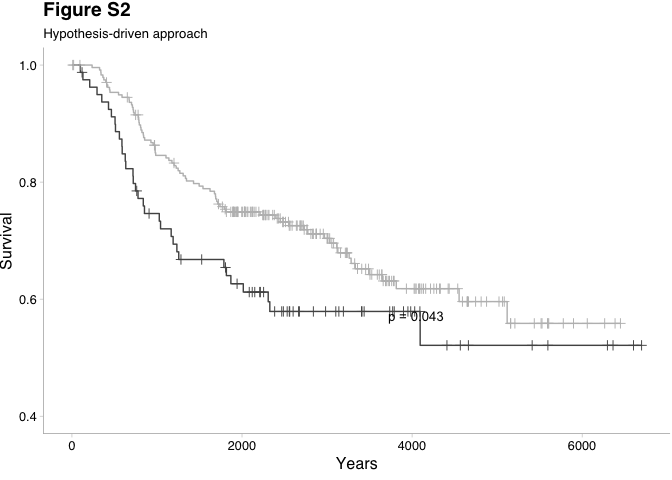
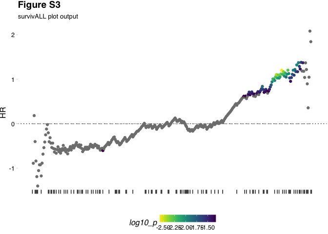
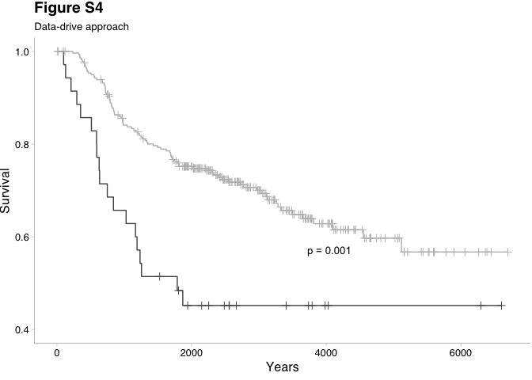

Rationale
================
Dominic Pearce
2018-04-30


Rationale
---------

 

### Libraries

``` r
library(survivALL)
library(survival)
library(survcomp)
library(Biobase)
library(magrittr)
library(ggplot2)
library(GGally)
library(ggthemes)
library(cowplot); theme_set(theme_grey())
```

 

Rationale
=========

Survival analysis typically stratifies a patient cohort by some measure and compares the relative survival between groups. In practice, for a continuous measure, the decision of *where* to draw this division relies on previous knowledge or, more problematically, it may simply be a researchers best guess - for example separating around the median. Below are outlined 3 alternative survival analysis approaches --- **median**, **hypothesis-driven** and our own **data-driven** approach as part of the `survivALL` package.

 

Median dichotomisation
----------------------

We begin with an expressionSet `nki`, which details both gene expression as well as survival information (i.e. event and time-to-event data) for 337 invasive breast cancer patients of no specific subtype. Here the event we will be measuring is distant metastasis free survival or *dmfs*.

It is important to ensure that there are no `NA` values in our survival information. In our example this has already been accounted for and the data is included as part of the `survivALL` package.

 

``` r
data(nki_subset)
```

``` r
pData(nki_subset)[1:3, ]
```

<table style="width:79%;">
<caption>Survival Information</caption>
<colgroup>
<col width="16%" />
<col width="18%" />
<col width="8%" />
<col width="11%" />
<col width="12%" />
<col width="12%" />
</colgroup>
<thead>
<tr class="header">
<th align="center"> </th>
<th align="center">samplename</th>
<th align="center">age</th>
<th align="center">grade</th>
<th align="center">e.dmfs</th>
<th align="center">t.dmfs</th>
</tr>
</thead>
<tbody>
<tr class="odd">
<td align="center"><strong>NKI_4</strong></td>
<td align="center">NKI_4</td>
<td align="center">41</td>
<td align="center">3</td>
<td align="center">0</td>
<td align="center">4747</td>
</tr>
<tr class="even">
<td align="center"><strong>NKI_6</strong></td>
<td align="center">NKI_6</td>
<td align="center">49</td>
<td align="center">2</td>
<td align="center">0</td>
<td align="center">4075</td>
</tr>
<tr class="odd">
<td align="center"><strong>NKI_7</strong></td>
<td align="center">NKI_7</td>
<td align="center">46</td>
<td align="center">1</td>
<td align="center">0</td>
<td align="center">3703</td>
</tr>
</tbody>
</table>

 

We can see that our complete survival data includes the three critical components of our analysis, namely *sample names*, *events (e.dmfs)* and *times-to-event (t.dmfs)*.

To determine a variables prognostic capacity we can apply the Kaplan-Meier estimator and plot. Here we will split our cohort using the expression of *ERBB2* a gene whose increased expression is known to be associated with poor prognosis in a mixed population of invasive breast cancers.

We will stratify the cohort into high and low *ERBB2* expression using median *ERBB2* expression...

 

``` r
#ERBB2 expression vector
erbb2_xpr <- exprs(nki_subset)["NM_004448",] 
#convert to binary classifier
erbb2_med <- ifelse(erbb2_xpr >= median(erbb2_xpr), "high", "low") 
```

 

...and produce our Kaplan-Meier plot and statistics

 

``` r
srv_obj <- survival::Surv(nki_subset$t.dmfs, nki_subset$e.dmfs)
median_fit <- survival::survfit(srv_obj ~ erbb2_med)

p_med <- GGally::ggsurv(median_fit, surv.col = c("#525252", "#bdbdbd")) +
    ylim(0.4, 1) +
    labs(title = "Figure S1", 
         subtitle = "Median approach", 
         x = "Years") +
    theme_pander() + 
    theme(axis.line = element_line(size = 0.1), 
          legend.position = 'bottom')

p_med <- ggdraw(add_sub(p_med, "p = 0.9", 
                    vpadding=grid::unit(0, "lines"), 
                    y = 17, 
                    x = 0.55, 
                    hjust = 0, 
                    size = 10))
p_med
```


 

``` r
broom::tidy(survival::coxph(srv_obj ~ erbb2_med)) %>% pandoc.table()
```

<table>
<colgroup>
<col width="17%" />
<col width="15%" />
<col width="14%" />
<col width="15%" />
<col width="11%" />
<col width="12%" />
<col width="12%" />
</colgroup>
<thead>
<tr class="header">
<th align="center">term</th>
<th align="center">estimate</th>
<th align="center">std.error</th>
<th align="center">statistic</th>
<th align="center">p.value</th>
<th align="center">conf.low</th>
<th align="center">conf.high</th>
</tr>
</thead>
<tbody>
<tr class="odd">
<td align="center">erbb2_medlow</td>
<td align="center">-1.434e-05</td>
<td align="center">0.1917</td>
<td align="center">-7.482e-05</td>
<td align="center">0.9999</td>
<td align="center">-0.3758</td>
<td align="center">0.3757</td>
</tr>
</tbody>
</table>

 

Surprisingly and despite ERBB2 known to be highly prognostic in invasive breast cancer, there is no association between ERBB2 expression and prognosis.

 

Hypothesis-driven dichotomisation
---------------------------------

However, knowing that ERBB2 is overexpressed in ~25% of invasive breast cancer cases, we can modify our cohort stratification to reflect this.

 

``` r
erbb2_hypothesis <- ifelse(erbb2_xpr >= quantile(erbb2_xpr, probs = 0.75), "high", "low") 
hypothesis_fit <- survival::survfit(srv_obj ~ erbb2_hypothesis)

p_hyp <- GGally::ggsurv(hypothesis_fit, surv.col = c("#525252", "#bdbdbd")) +
    ylim(0.4, 1) +
    labs(title = "Figure S2", 
         subtitle = "Hypothesis-driven approach", 
         x = "Years") +
    theme_pander() + 
    theme(axis.line = element_line(size = 0.1), 
          legend.position = 'none')
    
p_hyp <- ggdraw(add_sub(p_hyp, "p = 0.043", 
                        vpadding=grid::unit(0, "lines"), 
                        y = 17, 
                        x = 0.55, 
                        hjust = 0, 
                        size = 10))
p_hyp
```



 

``` r
broom::tidy(survival::coxph(srv_obj ~ erbb2_hypothesis)) %>% pandoc.table()
```

<table>
<caption>Table continues below</caption>
<colgroup>
<col width="28%" />
<col width="14%" />
<col width="15%" />
<col width="15%" />
<col width="12%" />
<col width="12%" />
</colgroup>
<thead>
<tr class="header">
<th align="center">term</th>
<th align="center">estimate</th>
<th align="center">std.error</th>
<th align="center">statistic</th>
<th align="center">p.value</th>
<th align="center">conf.low</th>
</tr>
</thead>
<tbody>
<tr class="odd">
<td align="center">erbb2_hypothesislow</td>
<td align="center">-0.3961</td>
<td align="center">0.2086</td>
<td align="center">-1.899</td>
<td align="center">0.05757</td>
<td align="center">-0.8049</td>
</tr>
</tbody>
</table>

<table style="width:15%;">
<colgroup>
<col width="15%" />
</colgroup>
<thead>
<tr class="header">
<th align="center">conf.high</th>
</tr>
</thead>
<tbody>
<tr class="odd">
<td align="center">0.01273</td>
</tr>
</tbody>
</table>

 

And consequently demonstrate a significant association between prognosis and ERBB2 expression.

 

Data-driven dichotomisation
---------------------------

By comparing multiple patient stratifications we have successful revealed ERBB2's relationship with prognosis based on a reasoned estimate of where we expect optimal stratification to occur. It may still be, however, that our cohort's composition in terms of ERBB2 expression does not exactly mirror population levels - i.e. that the *best* point-of-separation is not found with a 75-25% split. This will become even more problematic for a novel biomarker for which population levels may be unknown. A solution to this unknown quality is, instead of estimating where we anticipate our point-of-separation to occur, we calculate survival statistics for all separations possible.

For our 319 patients and having calculated our median and hypothesis divisions, there remain an additional 316 points at which we could otherwise stratify our cohort, any of which may demonstrate a more significant association with prognosis. By additionally calculating survival statistics for each of these possible point-of-separation we guarantee that we reveal the true optimal stratification.

We can visually inspect the best point of separation by using the `plotALL()` function.

 

``` r
plotALL(measure = erbb2_xpr,
        srv = pData(nki_subset), 
        time = "t.dmfs", 
        event = "e.dmfs") +
    labs(title = "Figure S3", subtitle = "survivALL plot output") + 
    theme(plot.title = element_text(hjust = 0))
```



 

We can now see that the best point at which we could separate our cohort based on ERBB2 expression is closer to a 85-15% split, rather than 75-25%, indicating a sampling bias towards HER2 negative patients in the NKI cohort.

We can further investigate the most significant separation using `survivALL()`, which follows the same procedure as `plotALL()` but returns a dataframe of calculations rather than plotting.

Using this we can select the point of most significant separation...

 

``` r
srvall <- survivALL(measure = erbb2_xpr,
               srv = pData(nki_subset), 
               time = "t.dmfs", 
               event = "e.dmfs", 
               measure_name = "ERBB2") 

srvall[which.min(srvall$p),] %>% pandoc.table()
```

<table>
<caption>Table continues below</caption>
<colgroup>
<col width="19%" />
<col width="13%" />
<col width="17%" />
<col width="10%" />
<col width="13%" />
<col width="10%" />
<col width="13%" />
</colgroup>
<thead>
<tr class="header">
<th align="center"> </th>
<th align="center">samples</th>
<th align="center">event_time</th>
<th align="center">event</th>
<th align="center">measure</th>
<th align="center">HR</th>
<th align="center">p</th>
</tr>
</thead>
<tbody>
<tr class="odd">
<td align="center"><strong>NKI_181</strong></td>
<td align="center">NKI_181</td>
<td align="center">3951</td>
<td align="center">FALSE</td>
<td align="center">0.474</td>
<td align="center">1.201</td>
<td align="center">0.002695</td>
</tr>
</tbody>
</table>

<table>
<colgroup>
<col width="18%" />
<col width="11%" />
<col width="12%" />
<col width="7%" />
<col width="12%" />
<col width="10%" />
<col width="10%" />
<col width="7%" />
<col width="7%" />
</colgroup>
<thead>
<tr class="header">
<th align="center"> </th>
<th align="center">p_adj</th>
<th align="center">log10_p</th>
<th align="center">bsp</th>
<th align="center">bsp_adj</th>
<th align="center">index</th>
<th align="center">name</th>
<th align="center">dsr</th>
<th align="center">clsf</th>
</tr>
</thead>
<tbody>
<tr class="odd">
<td align="center"><strong>NKI_181</strong></td>
<td align="center">0.1682</td>
<td align="center">-2.569</td>
<td align="center">NA</td>
<td align="center">NA</td>
<td align="center">284</td>
<td align="center">ERBB2</td>
<td align="center">NA</td>
<td align="center">0</td>
</tr>
</tbody>
</table>

 

...and re-draw our Kaplan-Meier

 

``` r
erbb2_data <- ifelse(srvall$clsf == 0, "low", "high") 
srv_obj <- survival::Surv(as.numeric(srvall$event_time), srvall$event)
data_fit <- survival::survfit(srv_obj ~ erbb2_data)

p_data <- GGally::ggsurv(data_fit, surv.col = c("#525252", "#bdbdbd")) +
    ylim(0.4, 1) +
    labs(title = "Figure S4", subtitle = "Data-drive approach", x = "Years") +
    theme_pander() + 
    theme(axis.line = element_line(size = 0.1), 
          legend.position = 'none')

p_data <- ggdraw(add_sub(p_data, 
                         "p = 0.001", 
                         vpadding=grid::unit(0, "lines"), 
                         y = 17, 
                         x = 0.55, 
                         hjust = 0, 
                         size = 10))
p_data
```



 

``` r
broom::tidy(survival::coxph(srv_obj ~ erbb2_data)) %>% pandoc.table()
```

<table style="width:100%;">
<colgroup>
<col width="19%" />
<col width="13%" />
<col width="14%" />
<col width="14%" />
<col width="13%" />
<col width="13%" />
<col width="13%" />
</colgroup>
<thead>
<tr class="header">
<th align="center">term</th>
<th align="center">estimate</th>
<th align="center">std.error</th>
<th align="center">statistic</th>
<th align="center">p.value</th>
<th align="center">conf.low</th>
<th align="center">conf.high</th>
</tr>
</thead>
<tbody>
<tr class="odd">
<td align="center">erbb2_datalow</td>
<td align="center">-0.8324</td>
<td align="center">0.253</td>
<td align="center">-3.29</td>
<td align="center">0.001002</td>
<td align="center">-1.328</td>
<td align="center">-0.3365</td>
</tr>
</tbody>
</table>
